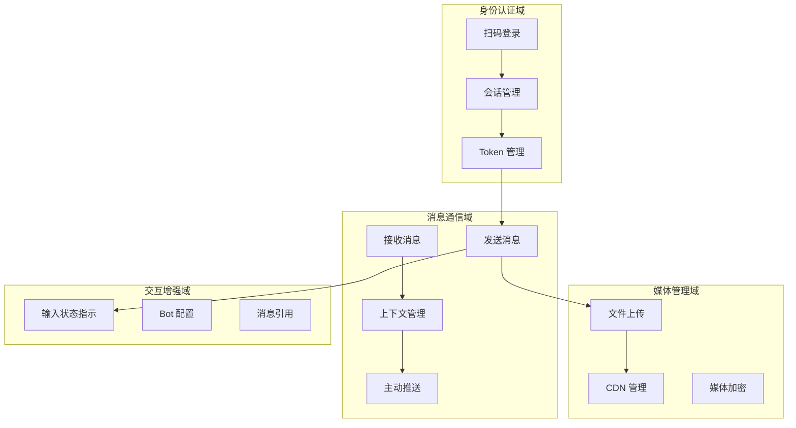

# 业务架构图（Business Architecture）

该图展示 openilink-sdk-java 的业务能力与业务领域。

## 业务说明

openilink-sdk-java 是微信 iLink Bot API 的 Java SDK，提供以下核心业务能力：

- **身份认证域**：扫码登录、会话管理
- **消息通信域**：接收消息、发送消息、主动推送
- **媒体管理域**：文件上传、CDN 管理
- **交互增强域**：输入状态指示、Bot 配置

## 业务能力说明

1. **身份认证域**：提供二维码扫码登录能力，管理 Bot 会话和认证 Token
2. **消息通信域**：核心业务能力，支持长轮询接收消息、回复消息和主动推送
3. **媒体管理域**：支持图片、视频、文件等多媒体内容的上传和管理
4. **交互增强域**：提供更好的用户体验，如输入状态提示等
