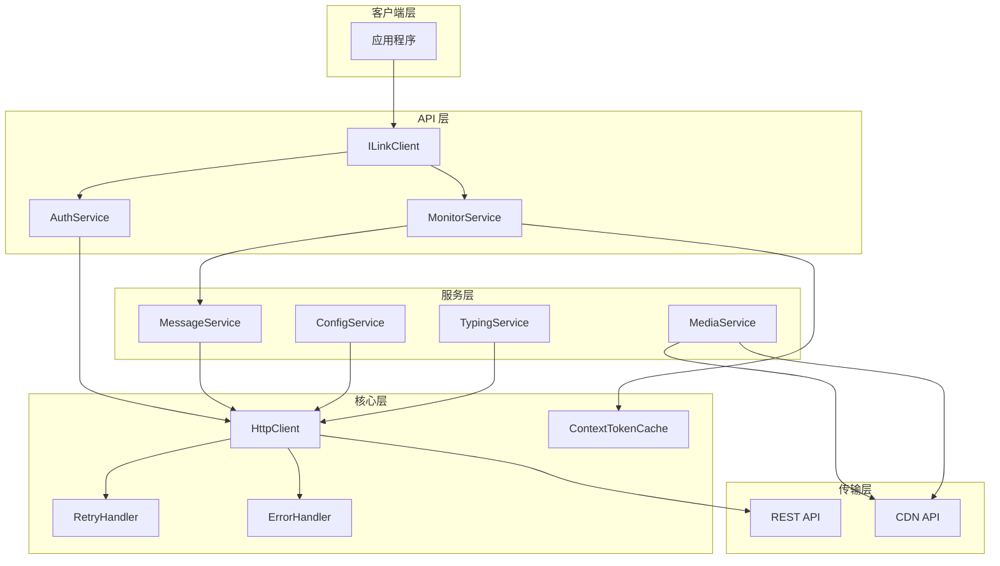

# 逻辑架构（Logical View）

该图展示 openilink-sdk-java 的核心技术架构和组件关系。

## 架构说明

采用分层架构设计，从客户端应用到底层 HTTP 传输，清晰分离各层职责。

## 核心组件

- **ILinkClient**：SDK 主入口，提供统一的 API 接口
- **AuthService**：处理扫码登录和会话管理
- **MonitorService**：长轮询消息监听，自动重试和退避
- **MessageService**：消息发送和接收处理
- **ContextTokenCache**：自动缓存用户上下文 Token
- **HttpClient**：统一的 HTTP 传输层，支持自定义
