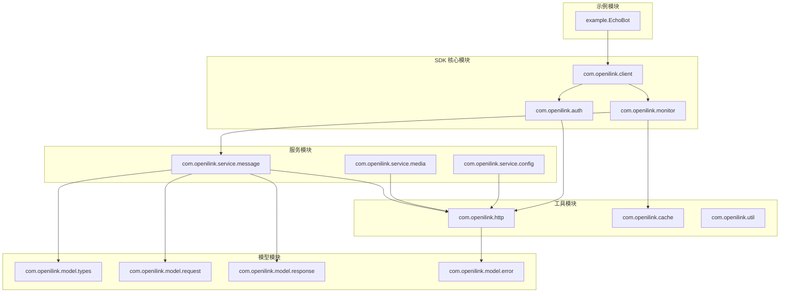

# 开发视图（Development View）

该图展示 openilink-sdk-java 的代码模块结构和依赖关系。

## 模块说明

项目采用标准 Maven 结构，按功能划分模块，保持低耦合高内聚。

## 模块职责

- **SDK 核心模块**：提供主要 API 接口和核心功能
- **服务模块**：封装各类业务服务逻辑
- **模型模块**：定义数据模型、请求响应结构
- **工具模块**：提供 HTTP 客户端、缓存等基础设施
- **示例模块**：提供使用示例和最佳实践
