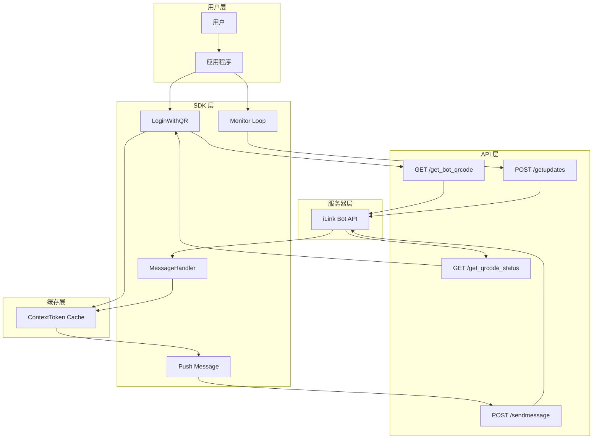

# 运行流程（Process View）

该图展示 openilink-sdk-java 运行时的数据流和交互流程。

## 流程说明

展示从扫码登录到消息收发的完整数据流转过程。

## 关键流程

1. **登录流程**：获取二维码 → 轮询扫码状态 → 获取 Token → 更新客户端配置
2. **监听流程**：长轮询 getUpdates → 接收消息 → 缓存 contextToken → 调用 Handler
3. **推送流程**：从缓存获取 contextToken → 发送消息 → 返回结果
