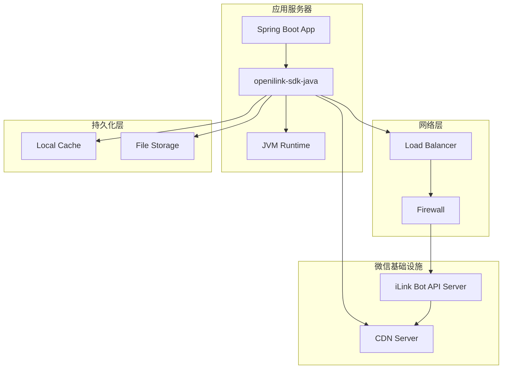

# 部署架构（Physical View）

该图展示 openilink-sdk-java 的部署结构和运行环境。

## 部署说明

SDK 作为客户端库集成到应用程序中，与微信 iLink Bot API 服务器通信。

## 部署要点

- **运行环境**：JDK 8+ 或 JDK 11+（推荐）
- **依赖管理**：Maven 或 Gradle
- **网络要求**：需要访问 ilinkai.weixin.qq.com 和 CDN 域名
- **持久化**：可选的本地缓存用于存储 sync_buf 和 contextToken
- **容器化**：支持 Docker 容器部署
- **集群部署**：支持多实例部署，但需注意消息去重
