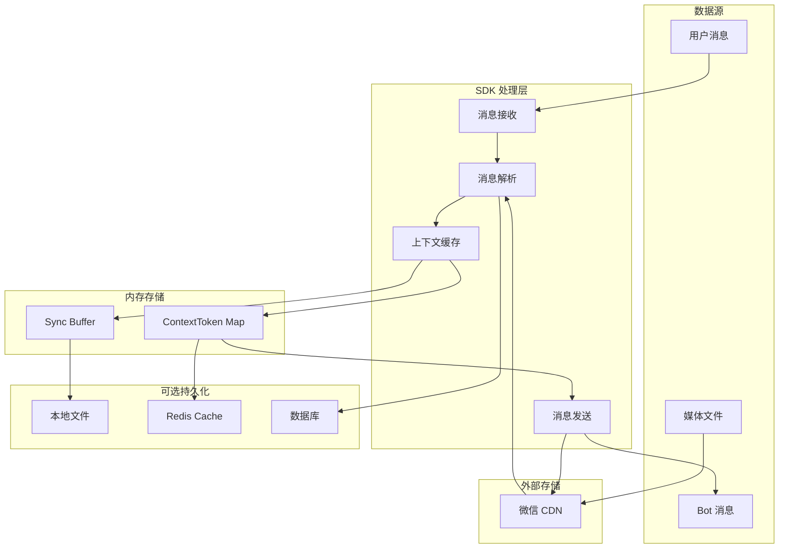

# 数据架构（Data Architecture）

该图展示 openilink-sdk-java 的数据流转和存储架构。

## 数据说明

SDK 主要处理实时消息数据，支持可选的本地持久化。

## 数据类型

1. **消息数据**
   - 文本消息（TextItem）
   - 图片消息（ImageItem）
   - 语音消息（VoiceItem）
   - 文件消息（FileItem）
   - 视频消息（VideoItem）

2. **会话数据**
   - BotToken：Bot 认证令牌
   - ContextToken：用户会话上下文令牌
   - SyncBuffer：消息同步游标

3. **媒体数据**
   - 加密参数（AESKey）
   - CDN 查询参数
   - 文件元数据

## 数据持久化策略

- **内存优先**：ContextToken 和 SyncBuffer 默认存储在内存
- **可选持久化**：支持将 SyncBuffer 持久化到文件，实现断点续传
- **外部存储**：支持集成 Redis 或数据库存储会话数据
- **媒体存储**：所有媒体文件存储在微信 CDN，SDK 仅处理引用
